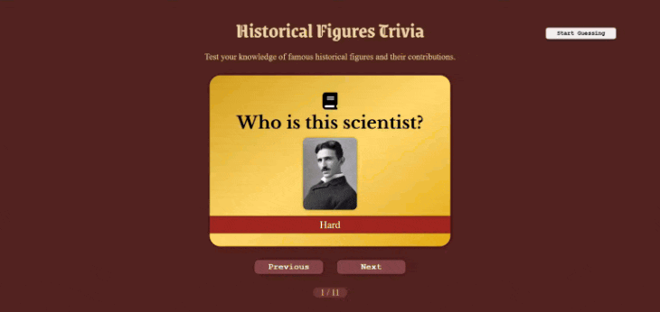

# Web Development Project 2 - _Historical Figures Trivia_

Submitted by: **Quynh Giang Ho**

This web app: **A flashcards app that helps you learn trivia about some of the most famous historical figures on the planet! See if you know their names or contributions. Try it out and have some fun!!!**

Time spent: **3** hours spent in total

## Required Features

The following **required** functionality is completed:

- [x] **The title of the card set and some information about it, such as a short description and the total number of cards are displayed**
- [x] **A single card at a time is displayed, only showing one of the components of the information pair**
- [x] **A list of card pairs is created**
- [x] **Clicking on the card shows the corresponding component of the information pair**
- [x] **Clicking the next button displays a random new card**

The following **optional** features are implemented:

- [x] Cards contains images in addition to or in place of text
- [x] Cards have different visual styles such as color based on their category
- [x] _visual style implemented_

The following **additional** features are implemented:

- [x] Guessing mode with score-keeping mechanism so users can have fun with guessing the answers
- [x] Making the website fully responsive

## Video Walkthrough

Here's a walkthrough of implemented required features:

<!-- Replace this with whatever GIF tool you used! -->

GIF created with [Chrome Capture - screenshot & GIF](https://chromewebstore.google.com/detail/chrome-capture-screenshot/ggaabchcecdbomdcnbahdfddfikjmphe)

<!-- Recommended tools:
[Kap](https://getkap.co/) for macOS
[ScreenToGif](https://www.screentogif.com/) for Windows
[peek](https://github.com/phw/peek) for Linux. -->

## Notes

During the app's development, I encountered these very fun challenges:

- Making the app's appearance suitable for the theme I chose
- Making the app fun for users so that they would revisit it or stay on it for a longer time
- Implementing the card flip animation and the integration of Guessing Mode

## License

    Copyright 2025 Quynh Giang Ho (Shepe1304)

    Licensed under the Apache License, Version 2.0 (the "License");
    you may not use this file except in compliance with the License.
    You may obtain a copy of the License at

        http://www.apache.org/licenses/LICENSE-2.0

    Unless required by applicable law or agreed to in writing, software
    distributed under the License is distributed on an "AS IS" BASIS,
    WITHOUT WARRANTIES OR CONDITIONS OF ANY KIND, either express or implied.
    See the License for the specific language governing permissions and
    limitations under the License.
